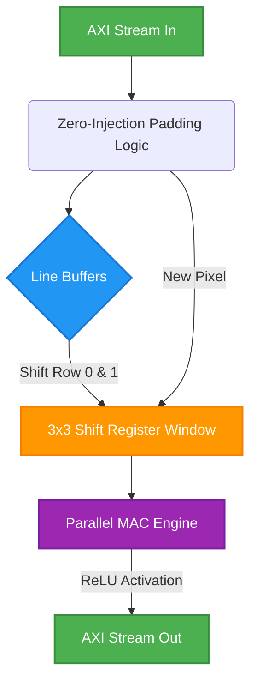
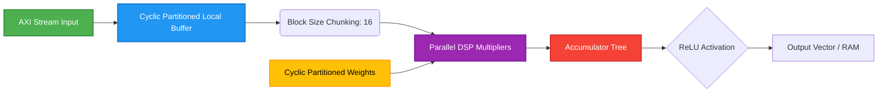

# Multimodal Vision-Language Model (VLM) for Chess

This repository contains the implementation of a lightweight autoregressive Transformer integrated with a CNN Vision Tower to provide vision intuition of spatial board states for chess.

## Features
- **Vision Tower**: A 3-layer CNN that encodes the 8x8x14 spatial board geometry.
- **Massive Inductive Bias**: Mathematically encodes board geometry to help the language model understand space.
- **Custom BPE Tokenizer**: Trained on Lichess PGN dataset to seamlessly fuse visual board states with sequential move history.
- **Self-Play**: Includes an interactive offline self-play script to test the model.

## Main Files
- `playground.py`: The main script for building, training, and testing the VLM architecture, including the NanoGPT models and the Vision Tower.
- `fetch_and_infer.py`: Script to fetch trained weights (from WandB) and play simulated games using the trained VLM.
- `simulated_game.pgn`: Contains an example output game generated by the models playing against each other.

## How to Run
Ensure you have PyTorch installed.
To train a model:
```bash
python playground.py
```

To run inference and generate games locally:
```bash
python fetch_and_infer.py
```

## Hardware Accelerator (CNN-MLP)
The repository now includes C++ implementations for hardware acceleration of the Vision Tower (CNN) and Multi-Layer Perceptron (MLP) components, located in the `Hardware Accelerator CNN-MLP` directory.
- **CNN Accelerator (`cnn_layer.cpp`)**: Hardware-optimized implementation of the 3-layer CNN used for encoding spatial board geometry.
- **MLP Accelerator (`mlp_layer.cpp`)**: Hardware-optimized implementation for fully connected layers.
- **Tensor Processing Unit (`tensor_processing_unit.cpp`)**: A top-level wrapper that integrates the CNN and MLP layers for streamlined hardware execution.

### How to Run C-Synthesis in Vitis HLS
To synthesize the C++ code into RTL architecture (Verilog/VHDL) for custom IP deployment on Edge TPUs or FPGAs:
1. Open Xilinx Vitis HLS.
2. Create a new project and add the C++ source files from the `Hardware Accelerator CNN-MLP` directory (`cnn_layer.cpp`, `mlp_layer.cpp`, `tensor_processing_unit.cpp`, `weights.h`).
3. Add `tensor_processing_unit_tb.cpp` as the testbench file.
4. Specify `tensor_processing_unit` as the top-level function.
5. Select your target FPGA/SoC part.
6. Run **C Simulation** to verify functional correctness.
7. Click **C Synthesis** to generate the RTL architecture.

### Hardware Architecture & Optimizations

The hardware accelerators for this VLM are designed using Xilinx Vitis HLS and incorporate several critical architectural optimizations to maximize throughput and minimize latency on FPGA/Edge TPU devices.

#### 1. CNN Vision Tower Accelerator
The CNN accelerator (`cnn_layer.cpp`) employs a highly parallel sliding-window architecture to process the 8x8 spatial board state geometries.

* **Line Buffers & Shift Registers**: Instead of storing the entire image in memory, the hardware uses line buffers (BRAM/URAM) to cache only the rows necessary for the current 3x3 convolution window. A completely partitioned shift register (`window[14][3][3]`) allows for simultaneous access to all 126 pixels of the receptive field in a single clock cycle.
* **Array Partitioning**: The `#pragma HLS ARRAY_PARTITION` directive completely decomposes the line buffers and local convolution windows into individual registers. This eliminates memory bottleneck constraints, feeding the massive parallel Multiplier-Accumulator (MAC) engines seamlessly.
* **Pipelining**: Applying `#pragma HLS PIPELINE II=1` to the column loop ensures that a new pixel is processed, and a new output vector is generated every single clock cycle. 
* **AXI4-Stream Interfaces**: The layer consumes inputs and produces outputs via `hls::stream`, synthesizing into hardware FIFO queues. This enables direct layer-to-layer communication without the latency of interacting with external DDR memory.



#### 2. MLP Fully Connected Accelerator
The MLP layers (`mlp_layer.cpp`) handle extremely dense matrix multiplications (e.g., projecting 384 features to 1536).

* **Tiled Matrix Processing (Block Processing)**: The matrix multiplication is chunked into `BLOCK_SIZE` tiles (e.g., 16 elements).
* **Cyclic Array Partitioning**: The input buffers and the weight matrices are partitioned cyclically (`#pragma HLS ARRAY_PARTITION ... cyclic factor=16`). This maps perfectly to block processing, allowing 16 memory reads simultaneously.
* **Loop Unrolling**: The inner tile multiplication loop uses `#pragma HLS UNROLL`, synthesizing directly into parallel DSP slices (hard-silicon multipliers).
* **Fixed-Point Quantization**: Both accelerators utilize `ap_fixed<16, 6>` data types, optimizing DSP usage and saving BRAM while maintaining inference accuracy.


